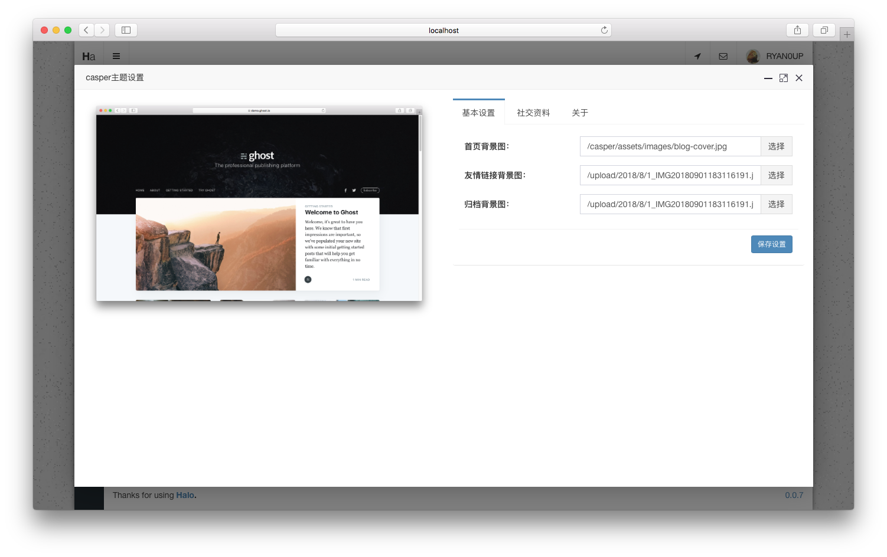

<h1><a href="#" target="_blank">Casper-Halo</a></h1>

> 一款Halo的主题，瀑布流式主题。

## 说明

该主题的原作者为[Ghost](https://github.com/TryGhost)，非常感谢做出这么优秀的主题。

原主题地址：[https://github.com/TryGhost/Casper](https://github.com/TryGhost/Casper)

## 预览截图

## 预览地址

[Ghost](https://demo.ghost.io)

## 注意

该主题能渲染`首页(/)`，`文章页(/archives/${postUrl})`，`归档(/archives)`，`友情链接(/links)`，`自定义页面(/p/${postUrl})`，`分类(/categories/${cateUrl})`，`标签(/tags/${tagUrl})`。

## 使用方法

1. 克隆或者[下载](https://github.com/ruibaby/casper-halo/releases)。
2. 将文件夹名改为`casper`，将文件夹名改为`casper`,将文件夹名改为`casper`！！！
3. 压缩为zip压缩包之后在后台的主题设置直接上传即可使用。

